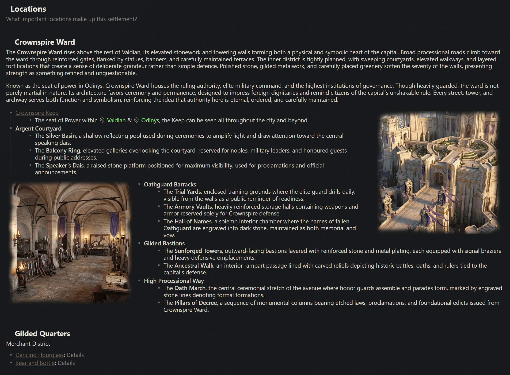

# Context Focus

Context Focus reduces visual clutter by keeping the content around your pointer clear while gently fading surrounding text.

## Features

- Works with paragraphs, bullet lists, and numbered lists.
- Follows nested lists to their top-level parent.
- Works in Reading view by default.
- Can optionally be enabled in Live Preview and Source mode.
- Focuses paragraphs within their current heading section without dimming lists, headings, images, or callouts.
- Allows list and paragraph focusing to be disabled independently.
- Can fade only connected content or everything else in the note.
- Includes a configurable focus buffer to prevent flashing when moving between items.
- Includes a configurable fade duration.
- Includes a ribbon button and command to toggle all focus effects.

## Installation

### Community plugins

Install **Context Focus** from Obsidian's Community plugins browser.

### Manual installation

1. Create `.obsidian/plugins/context-focus` inside your vault.
2. Copy `main.js`, `manifest.json`, and `styles.css` into that folder.
3. Reload Obsidian.
4. Enable **Context Focus** under **Settings > Community plugins**.

## Usage

Hover over a paragraph or list item in Reading view. Context Focus keeps the relevant content clear and fades the surrounding content according to your settings.

Use the eye button in the left ribbon to turn all focus effects on or off. You can also run **Context Focus: Toggle focus effects** from the command palette and assign it a keyboard shortcut under **Settings > Hotkeys**.

## Settings

### Focus targets

- **Focus lists:** Focus list branches and their connected parents.
- **Focus paragraphs:** Focus paragraphs within the same heading section.
- **Focus in editing mode:** Apply focus effects in Live Preview and Source mode. This is disabled by default.

### Fade behaviour

- **Fade scope:** Fade connected content only or everything else in the note.
- **Focus buffer:** Wait briefly before clearing focus when the pointer moves between items. The default is 150 milliseconds.
- **Fade duration:** Control how quickly content fades.

## Compatibility

Context Focus is a desktop plugin because its interaction is based on pointer hover. It does not access the network or files outside your vault.

## License

[MIT](LICENSE)
